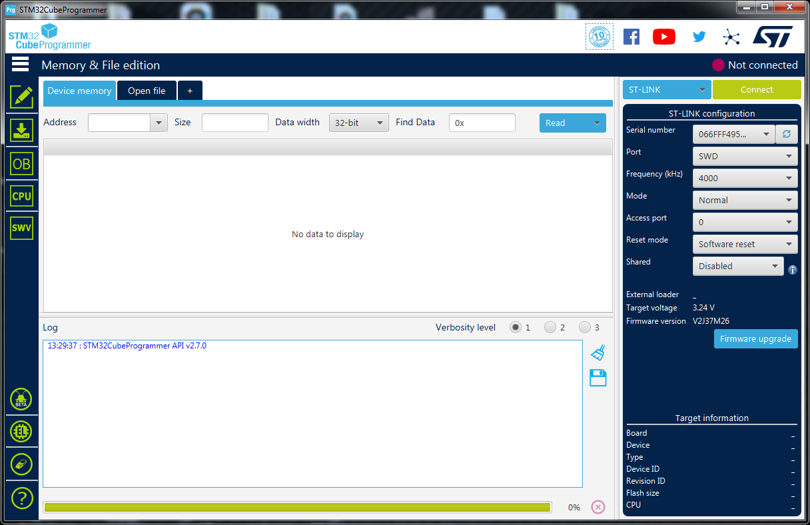
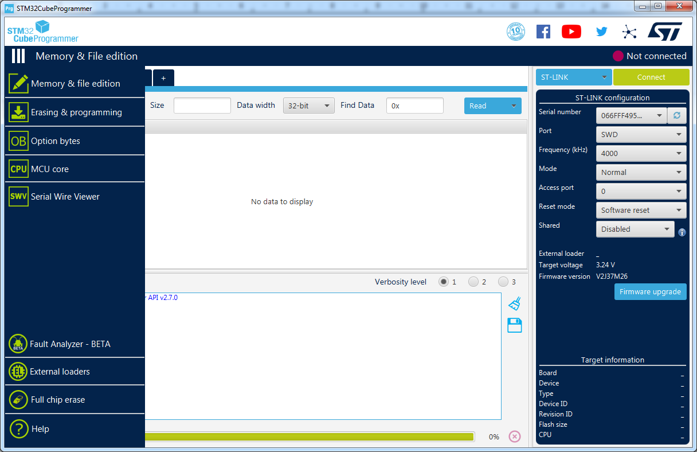
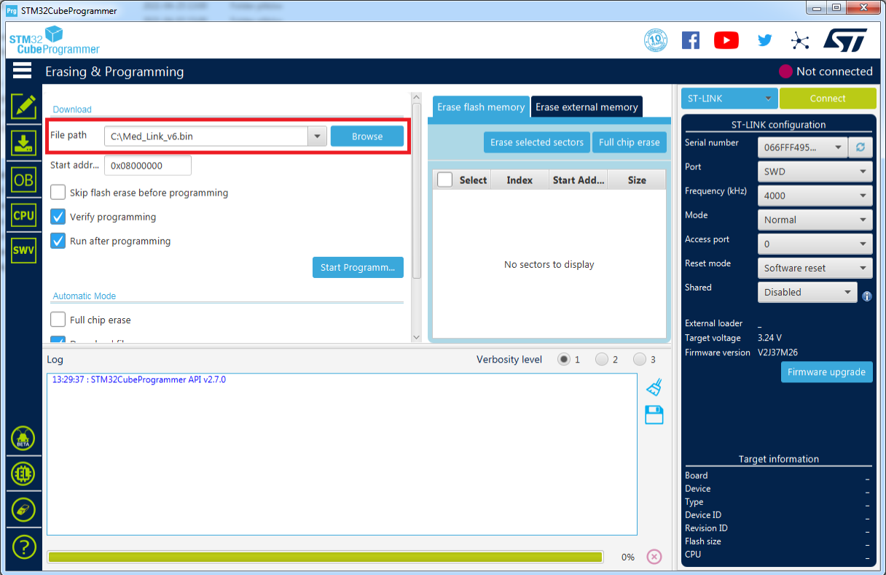
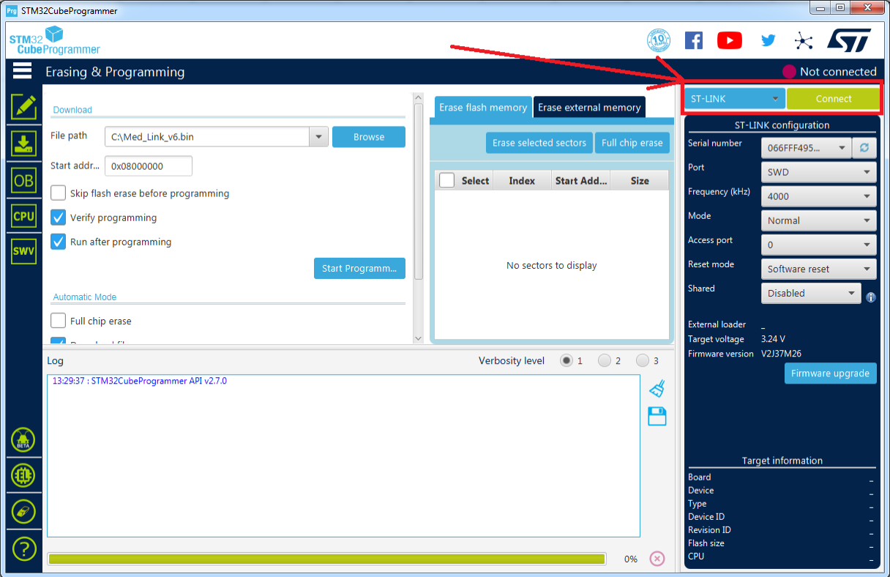
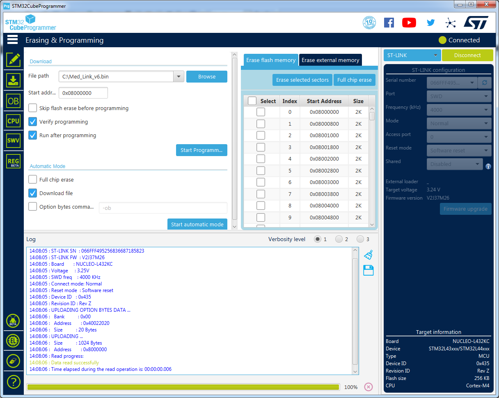
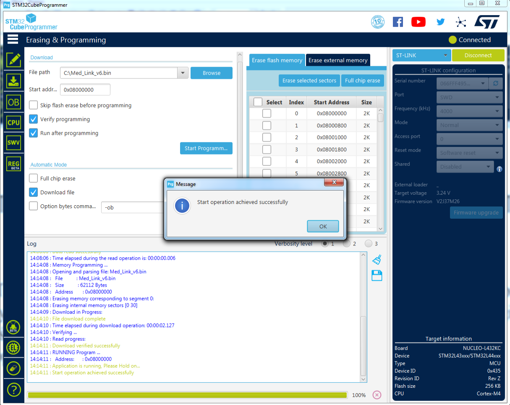
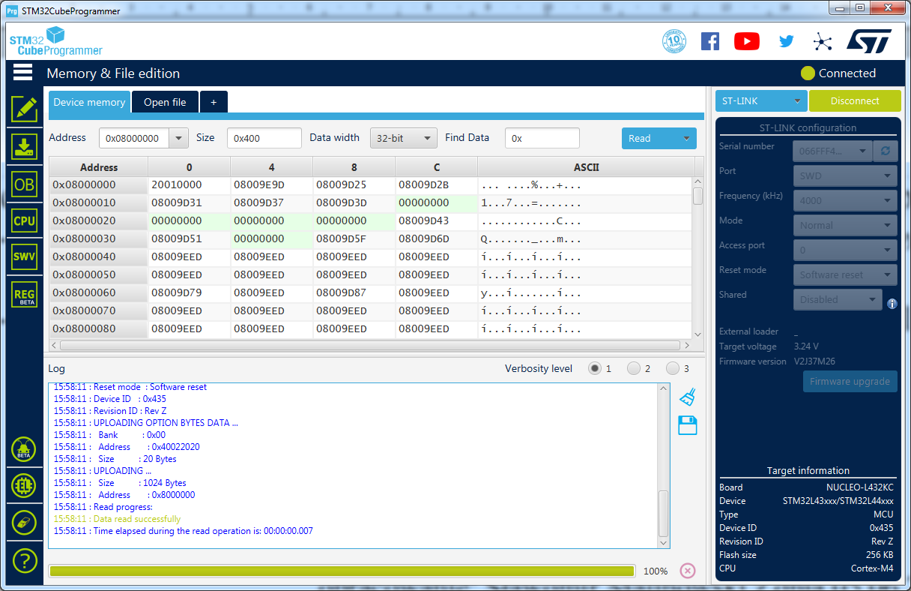
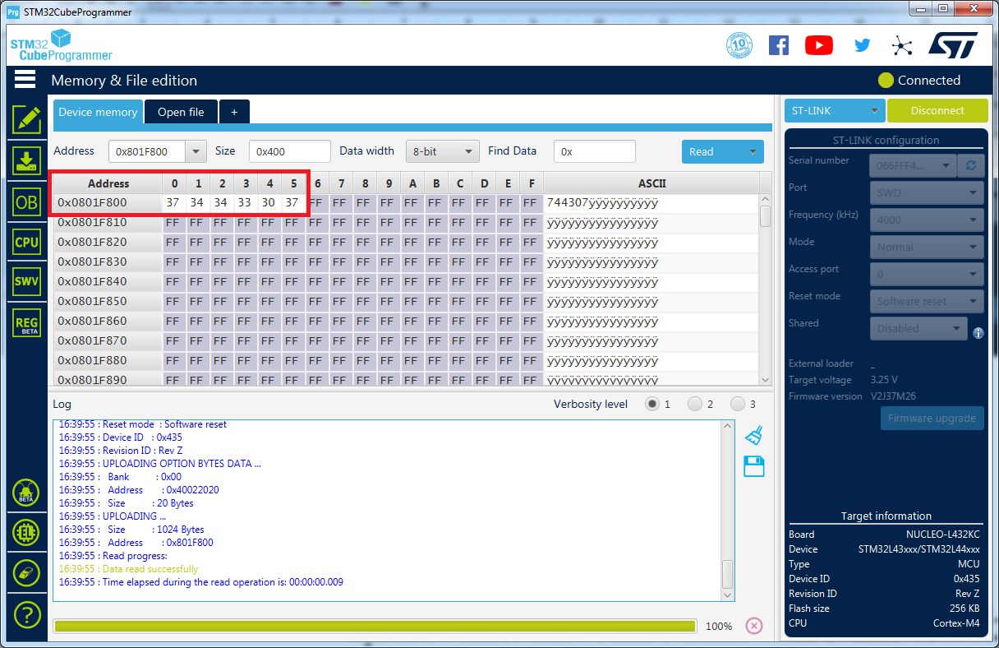

## How to programm the MED-Link V6 with STM32L432KC Nucleo microcontroller: 
This document can be found in [Polish](https://github.com/sarunia/Med-Link-v6-prototype/Instrukcja%20programowanie%20pilota%20Med-Link%20v6.md).
The first step will be to download the STM32 programming free software from the factory website:
https://www.st.com/en/development-tools/stm32cubeprog.html

You will need to register at their website to get the download link, to register you will need to provide your email. With the link you will be able to download the STM32Cubeprogrammer software. The install can be done following the default settings, which will install the driver to communicate with the pilot board. The Nucleo tile has a built-in programmer / debugger, so you can connect direct to the MicroUSB port from the computer's USB slot. 

At the image below you can see the program window after launch: 

The left side menu has some actions:

Clicking at the "Erasing & Programming" tab, you have to choose the firmware [med_link_v6.bin](https://github.com/sarunia/Med-Link-v6-prototype/Med_Link_v6_20210612.bin) for the Pilot V6 which downloaded file from github , : 

In the upper right corner, select the "St-Link" connection and connect to the Nucleo board by clicking at "Connect": 

STM32Cubeprogrammer automatically establishes and recognize a connected Nucleo board and it will display detailed the information in the panel with the logo.
If the connection is correct, just uploading a file by clicking on the "Start Programm ..." icon. The file upload procedure is very fast and if the verification went successful, you can close the STM32cubeprogrammer window. 

To make a bit easier the pump communication it's serial number will be saved using the STM32cubeprogrammer program without testing the pump communication. This number can always be update in case of a mistake. 

To save the pump serial number to the Flash memory:
     • Run STM32cubeprogrammer and connect by clicking "Connect"
     • In the "Memory & File Edition" tab, the "Device Memory" panel is opened by default, which look like: 

Flash memory cells start with the address 0x8000000 so you won't take the first available cells, we have to go to the scope of Page63
which starts with the address 0x801f800 and we change the display method to 8 bits values according to the screenshot below. In the "Address" field, copy and paste 0x801F800, in the "Data Width" field, select the length of the 8-bit. 

By default, all cells on this range are saved in terms of 0xFF, STM32Cubeprogram allows you to directly write their own values at individual cells. Here you should use the HEX values, so that the program can recognize the stored numbers on each position, the programm will to add 0x30 each of the digits of your s erial number. The easiest way can do do this is: each entered value must have on tens of the number "3" and in the unity position of the digit from the pump number.
For example, as showed below the pump number is 744307. Entering this value ​​for each cell consists in double-clicking at each cell, then the cursor starts to blink, enter your own cell value and approve Enter. The entry field with a flashing cursor is virtually narrow and invisible, so the value entered in principle is visible only after entering approval. After saving in this way, all necessary cells exactly from the indicated row and location columns will result in a permanent record of its pump number in the remote control. Finally, to disconnect the programmer by clicking on "Disconnect" and close the STM32cubeprogrammer. Good luck! 

Elaborated by: Sławomir Malinowski on 2021/06/12
Translated by: Dirceu Semighini Filho on 2021/06/12